# Cron Schedule

Operational schedule for the main Furina automation jobs.

```mermaid
gantt
    title Furina Automation Cadence
    dateFormat HH:mm
    axisFormat %H:%M

    section High-frequency monitoring
    Large prints scanner          :lp, 00:00, 24h
    Position and TP/SL monitor    :mon, 00:00, 24h
    Funding extreme alert         :fund, 00:00, 24h
    Risk manager and reconciler   :risk, 00:00, 24h

    section Signal scanners
    Aggressive scanner 15m        :aggr, 00:00, 24h
    Medium scanner 30m            :med, 00:05, 24h
    Safe scanner 2h               :safe, 00:10, 24h
    Binance Alpha scanner 15m     :alpha, 00:00, 24h

    section Market intelligence
    Smart Money Move 15m          :smart, 00:00, 24h
    Market-cap move alert 15m     :mcap, 00:00, 24h
    Volume breakout alert 30m     :vol, 00:00, 24h

    section Scheduled reports
    Daily signal report           :milestone, daily, 07:00, 0m
    Asia session overview         :milestone, asia, 09:00, 0m
    Europe session overview       :milestone, eu, 16:00, 0m
    US session overview           :milestone, us, 22:00, 0m
```

Note: this is a conceptual cadence diagram. Exact cron expressions can differ between deployments and should be checked in the live Hermes cron registry.
