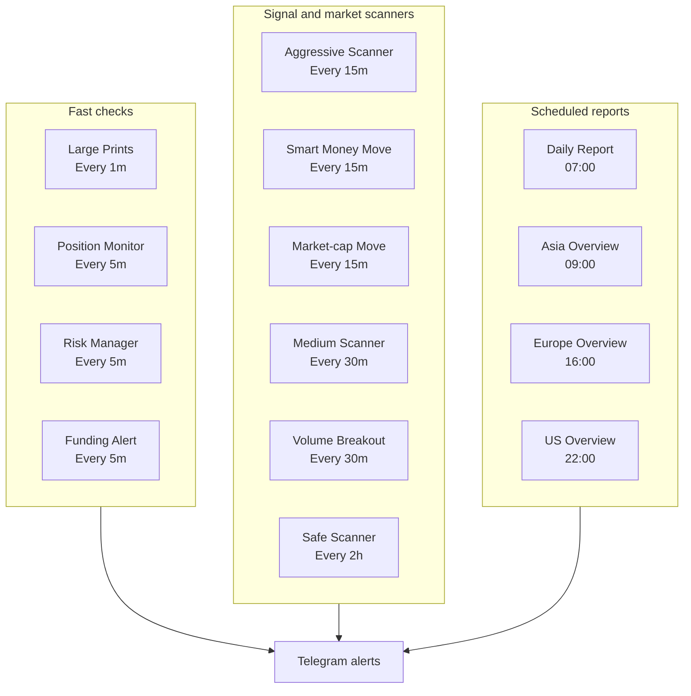

# Cron Schedule

This page explains how often each Furina automation job runs. It uses a table first because it is easier to read than a dense timeline.

## Human-readable Schedule

| Workflow | Purpose | Typical cadence |
| --- | --- | --- |
| Large Prints | Detect unusually large Binance spot/perp trades | Every 1 minute |
| Position Monitor | Watch active entries, TP, SL, and BE events | Every 5 minutes |
| Risk Manager | Watch drawdown and account risk | Every 5 minutes |
| Funding Alert | Alert if perp funding is above +1% or below -1% | Every 5 minutes |
| Aggressive Scanner | Fast setups on lower timeframes | Every 15 minutes |
| Smart Money Move | Detect smart wallet accumulation | Every 15 minutes |
| Market-cap Move Alert | Detect large 4H/1D market-cap moves | Every 15 minutes |
| Medium Scanner | Cleaner 1H/4H setups | Every 30 minutes |
| Volume Breakout | Detect large 1H volume breakouts | Every 30 minutes |
| Safe Scanner | Slower 4H/1D setups | Every 2 hours |
| Daily Report | Summarize signal and trade status | 07:00 |
| Session Overviews | Asia, Europe, and US market summaries | 09:00, 16:00, 22:00 |

## Grouped Diagram

## Note

Exact cron expressions can differ between deployments. Use the live Hermes cron registry as the source of truth when operating the bot.
