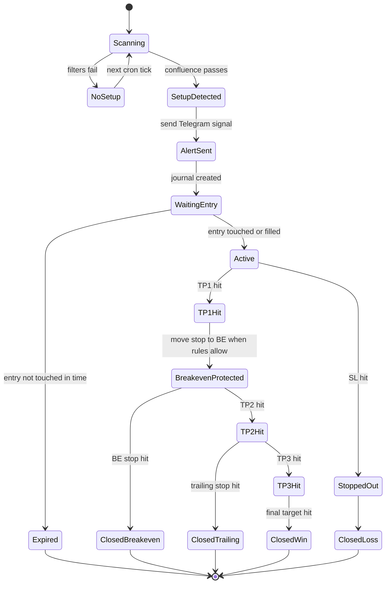

# Signal Lifecycle

Lifecycle of a Furina-generated trading signal from detection to final report.

This diagram is intentionally risk-first: every active signal must have a defined invalidation path, not only upside targets.
