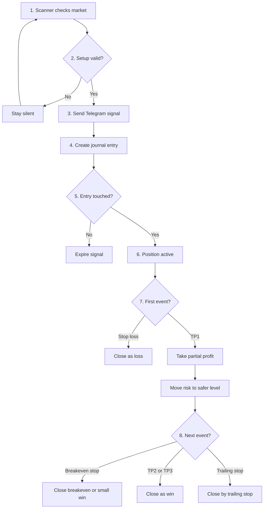
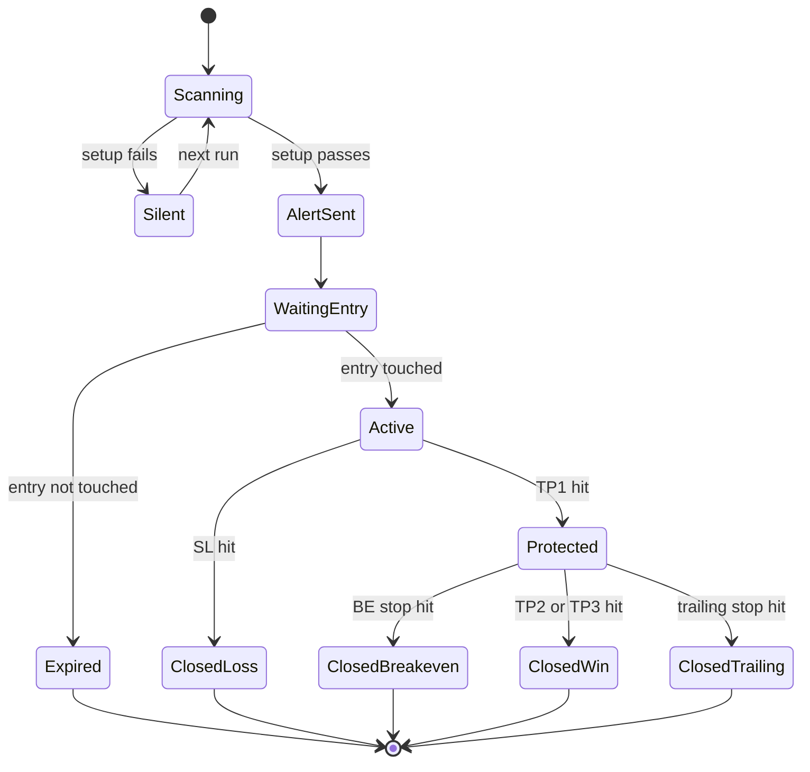

# Signal Lifecycle

This diagram explains what happens after Furina finds a trading setup.

## Main Path

## State Machine

## Meaning

- Silent means Furina found no high-quality setup.
- Waiting Entry means the signal exists, but price has not reached the entry area.
- Active means the trade is live and must be monitored.
- Protected means TP1 was hit and risk should be reduced.
