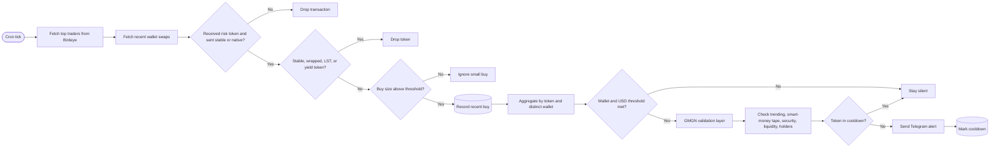

# Smart Money Move Flow

Pipeline used by the Smart Money Move topic to turn on-chain wallet activity into concise alerts.

The goal is early discovery, not automatic execution. GMGN is used as an extra validation layer on top of Birdeye discovery.
