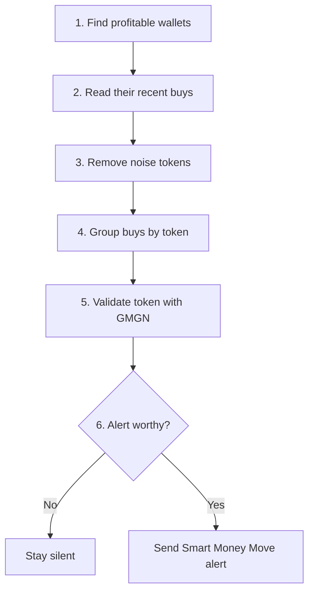
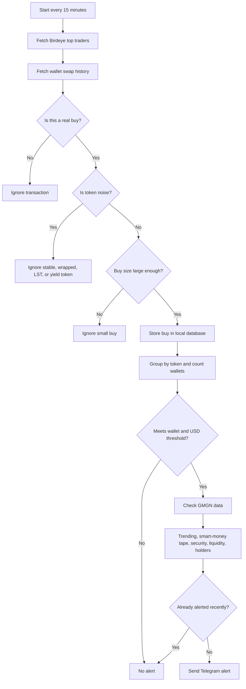

# Smart Money Move Flow

This diagram explains how Furina turns wallet activity into a Smart Money Move alert.

## Simple Overview

## Detailed Filter Flow

## What GMGN Adds

- Confirms whether the token is trending.
- Checks smart-money buy tape from another source.
- Adds basic token safety and liquidity context.
- Helps reduce low-quality Birdeye-only alerts.
