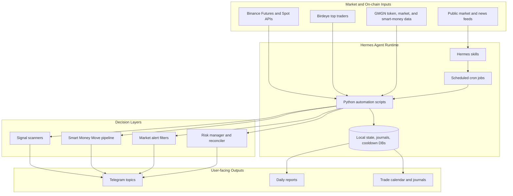

# System Architecture

High-level map of the Furina skill and automation stack.

Core idea: Furina uses skills for behavior and playbooks, scripts for repeatable automation, and cron jobs to keep market monitoring alive without manual prompting.
