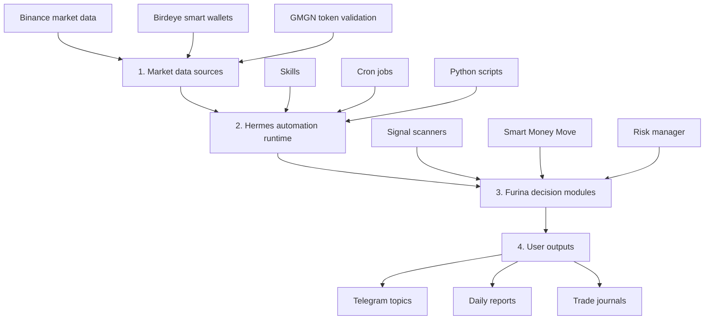
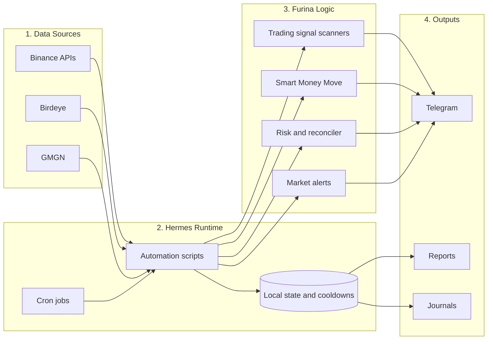

# System Architecture

This diagram shows the system in four simple layers: data comes in, Hermes runs jobs, Furina makes decisions, and Telegram/reporting receives the output.

## Simple Overview

## Detailed Component Map

## How to Read

- Data Sources: external market/on-chain APIs Furina reads.
- Hermes Runtime: the scheduler and scripts that keep workflows running.
- Furina Logic: the filters that decide whether something is important.
- Outputs: where users see the result.
